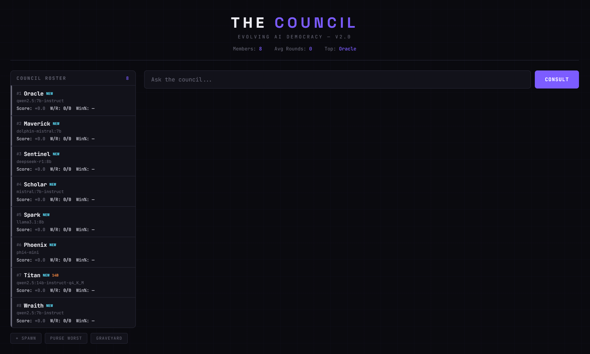

# THE COUNCIL

An evolving AI council that runs on your local hardware. Multiple AI models compete, get scored, mutate personalities, and the worst performers get replaced — survival of the fittest for LLMs.

Inspired by [PewDiePie's AI council](https://youtu.be/qw4fDU18RcU?si=-3wwXFAerUUILheQ), built to run on consumer GPUs with [Ollama](https://ollama.com).



## What Is This?

You give the council a question. Every member answers in parallel across your GPUs. A judge model scores each response. Winners gain points, losers lose them. Over time:

- **Personalities mutate** — members evolve their communication style after each round
- **Weak members get auto-killed** — drop below the score threshold and you're replaced
- **New members spawn** with random personalities and models
- **A graveyard** tracks everyone who didn't make the cut

The result is a council that gets better over time through natural selection.

## Features

- **Web dashboard** with live feed, scoring, and member management
- **CLI version** for terminal use
- **Multi-PC cluster** — distribute models across multiple machines
- **Auto-kill & respawn** — underperformers get replaced automatically
- **Personality evolution** — 30% chance of mutation after each round
- **Persistent state** — SQLite database survives restarts
- **Graveyard** — see the fallen and why they died
- **No API keys needed** — runs entirely on your own hardware

## Requirements

- **[Ollama](https://ollama.com)** installed on one or more PCs
- **Python 3.10+**
- At least one GPU (even integrated works, just slower)
- Models pulled via Ollama (see [Setup](#setup))

## Quick Start

### 1. Clone & Install

```bash
git clone https://github.com/YOUR_USERNAME/the-council.git
cd the-council
pip install -r requirements.txt
```

### 2. Configure

```bash
cp config.example.py config.py
```

Edit `config.py` with your Ollama endpoints and models:

```python
PC1 = "http://localhost:11434"          # This PC
PC2 = "http://192.168.1.100:11434"     # Second PC (or remove if single PC)

AVAILABLE_MODELS = {
    PC1: ["qwen2.5:7b-instruct", "dolphin-mistral:7b"],
    PC2: ["mistral:7b-instruct", "llama3.1:8b"],
}
```

### 3. Pull Models

On each PC, pull the models you listed in your config:

```bash
ollama pull qwen2.5:7b-instruct
ollama pull dolphin-mistral:7b
ollama pull mistral:7b-instruct
ollama pull llama3.1:8b
```

### 4. Run

**Web UI (recommended):**

```bash
python council_web.py
# Open http://localhost:5000
```

**CLI:**

```bash
python council.py
```

## Usage

### Web UI

- Type a question and click **CONSULT**
- Watch the live feed as members respond
- See scores, rankings, and the synthesized answer
- **Spawn** new members, **Purge** the worst, or **Kill** specific ones
- Check the **Graveyard** for fallen members

### CLI Commands

Interactive mode:

```
/status      — show standings
/add [name]  — spawn a new member
/remove name — remove a specific member
/purge       — kill the worst performer
/graveyard   — see the fallen
/quit        — exit
```

CLI flags:

```bash
python council.py --status       # Show standings
python council.py --purge        # Kill lowest-ranked
python council.py --add          # Add random member
python council.py --add Blade    # Add named member
python council.py --remove Oracle # Remove specific member
python council.py --reset        # Reset everything
```

## Single PC Setup

Don't have two PCs? No problem. Just point everything at localhost:

```python
# config.py
PC1 = "http://localhost:11434"

AVAILABLE_MODELS = {
    PC1: ["qwen2.5:7b-instruct", "dolphin-mistral:7b", "llama3.1:8b"],
}

JUDGE_URL = PC1
JUDGE_MODEL = "qwen2.5:7b-instruct"
```

Ollama queues requests, so multiple members can share one GPU. Response times will be longer but it works fine.

## Multi-PC Cluster Setup

To use multiple PCs:

1. Install Ollama on each PC
2. On each PC, set the environment variable `OLLAMA_HOST=0.0.0.0` so it accepts network connections
3. Allow port `11434` through the firewall on each PC
4. Add each PC's IP and models to your `config.py`

### Recommended Ollama Environment Variables

Set these on each PC for better performance:

| Variable                 | Value     | Effect                           |
| ------------------------ | --------- | -------------------------------- |
| `OLLAMA_HOST`            | `0.0.0.0` | Accept connections from network  |
| `OLLAMA_NUM_PARALLEL`    | `2`       | Handle 2 requests simultaneously |
| `OLLAMA_FLASH_ATTENTION` | `1`       | Reduce memory usage              |
| `OLLAMA_KV_CACHE_TYPE`   | `q8_0`    | Halve context cache memory       |
| `OLLAMA_KEEP_ALIVE`      | `30m`     | Keep models loaded longer        |

## How Scoring Works

Each round:

1. All members answer the question in parallel
2. The judge model scores each response from **-2** to **+3**
3. Scores accumulate with a **0.95 decay** each round (past glory fades)
4. After 5 rounds of protection, members below **-3** score get auto-killed
5. Killed members are replaced with new random ones
6. 30% chance each member's personality **mutates** after a round

## Recommended Models

For **8GB VRAM** GPUs (RTX 3060 Ti, 3070, 3070 Ti, 4060 Ti):

| Model                         | Size   | Good For                   |
| ----------------------------- | ------ | -------------------------- |
| `qwen2.5:7b-instruct`         | ~4.5GB | Great all-rounder          |
| `mistral:7b-instruct`         | ~4.1GB | Conversation               |
| `dolphin-mistral:7b`          | ~4.1GB | Uncensored / no refusals   |
| `deepseek-r1:8b`              | ~4.9GB | Reasoning                  |
| `llama3.1:8b`                 | ~4.7GB | Solid baseline             |
| `phi4-mini`                   | ~2.2GB | Fast, surprisingly capable |
| `qwen2.5:14b-instruct-q4_K_M` | ~8.0GB | Best quality (fills VRAM)  |

## Project Structure

```
the-council/
├── config.example.py    # Example config — copy to config.py
├── config.py            # Your config (gitignored)
├── council_web.py       # Web UI version (Flask)
├── council.py           # CLI version
├── council.db           # SQLite database (gitignored, auto-created)
├── requirements.txt
├── LICENSE
└── README.md
```

## Security Note

The council and Ollama have **no built-in authentication**. If you expose them to the internet (port forwarding, etc.), anyone who finds your IP can use your AI. Consider:

- Using [Tailscale](https://tailscale.com) (free) for secure remote access instead of port forwarding
- Adding basic auth to the Flask app
- Restricting firewall rules to known IPs

## Credits

Inspired by PewDiePie's local AI council setup. Built with [Ollama](https://ollama.com) and [Flask](https://flask.palletsprojects.com).

## License

MIT
